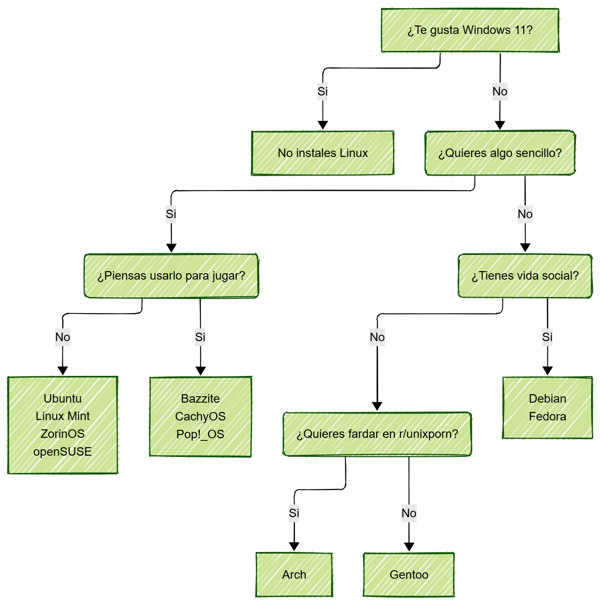

El pasado día 14 de Octubre de 2025, Microsoft anunció oficialmente el fin del soporte para Windows 10, salvo para Europa, donde puedes ampliarlo durante un año gracias a la Unión Europea.

    <figure>
        
    </figure>

Y esto ha sido una buenísima noticia para Linux. Ya que, gracias al rechazo general de la comunidad hacia Windows 11, donde Microsoft quiere forzarnos a ir, está provocando un interesante aumento de usuarios de Linux en escritorio. Aunque ya tuvimos un repunte gracias a Steam Deck y Valve, este incremento puede ser mucho más significativo (*toco madera*).

Sin embargo, la comunidad del pingüino es enorme, hay literalmente [miles de opciones](https://distrowatch.com/dwres.php?resource=family-tree), y esto obviamente, abruma muchísimo a los recién llegados. ¿Cuál me instalo? ¿Funcionará bien este software aquí? ¿Podré usarlo para jugar o tendré que forzarme a seguir en Windows? Muchas incógnitas. Muchos problemas. Así que, para ayudar a los nuevos usuarios a elegir, reduje la lista a un puñado de distribuciones bien mantenidas, amigables para recién llegados y con una comunidad activa (verificado por mi).

    <figure>
        
    </figure>

También menciono a aquellos que se han empapado tanto en contenido como el de [r/unixporn](https://www.reddit.com/r/unixporn) que ahora sueñan con instalar Arch con Hyprland solo para poder tener su primer rice. Quería añadir otras cosas como Funtoo, cualquier distribución basada en Arch pero en modo fácil, y demás, pero creo que quedaría un gráfico excesivamente complejo.

Lo generé usando [Mermaid](https://www.mermaidchart.com/d/f57518fd-3e90-4855-8e95-c1921edf4943), que lo he descubierto hace poco y es muy resultón, además de que se puede integrar con GitHub y Jekyll.
